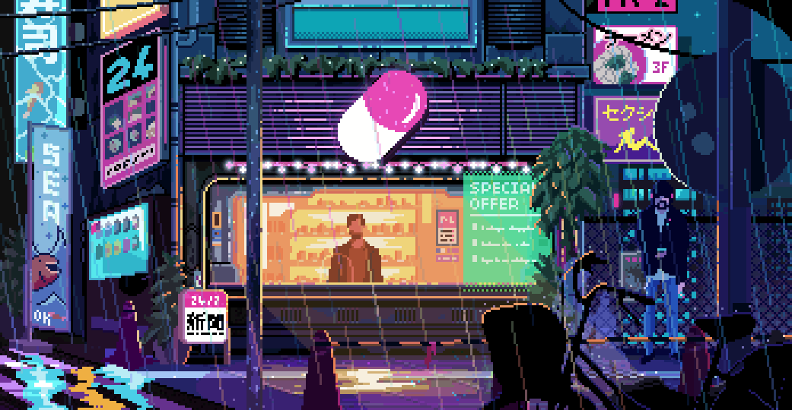
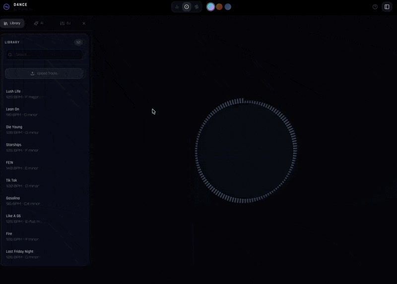
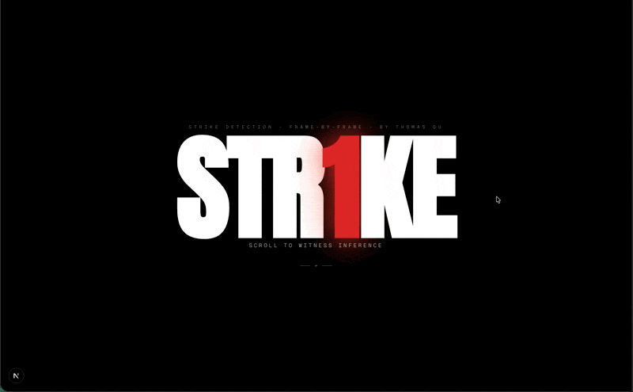
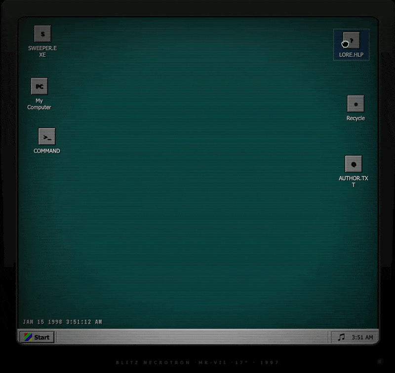

  

# Hi there, I'm Thomas Ou

<pre>
xxx xxx xxx xxx xxx xxx xxx xxx xxx xxx xxx xxx xxx xxx xxx   thomas@ou ---------------------------------------------
xxx xxx xxx xxx xxx xx;             .+x xxx xxx xxx xxx xxx   . OS: . . . . . . . . . . . . . . . . . . macOS Sequoia
xxx xxx xxx xxx xxx                         xxx xxx xxx xxx   . Uptime: . . . . . . . . . . . . .  19 years, 4 months
xxx xxx xxx x                                 : xxx xxx xxx   . Host: . . . . . . . . . . . . . . .  Philadelphia, PA
xxx xxx x                                         x xxx xxx   . Kernel: . . . . . . . . . . . . . . .  TypeScript 5.x
xxx xx+                                             xxx xxx   . Shell: . . . . . . . . . . . . . . . . . . zsh + fish
xxx x;                                               xx xxx   . IDE: . . . . . . . . . . . . . . . . . . VS Code, Vim
xxx x                     . ..                        x xxx                                                          
xxx                      .: ::: ..                      xxx   . Lang.Programming: . . TypeScript, Python, Rust, OCaml
xxx                       . ::: :..                     xxx   . Lang.Frameworks: . . React, Next.js, FastAPI, PyTorch
xx+                          .: ::.      .: .            xx   . Lang.Real: . . . . . . . . . . . .  English, Mandarin
xx:                  ..  ..  .: ::: ..    . ::: ::       xx                                                          
xxx           . .           ..: ;;: :.      .   .:.      xx   . Interests.Physical: . . .  Boxing, Judo, Powerlifting
xxx           . ..       .: ::: ;;: ::: ::: :;; ;;:      xx   . Interests.Hobbies: . . . . .  Chess, Poker, Saxophone
xxx          :: ;;: ::: ::: ::: ;+; ;:; ;;; ++; +;; .    xx   - Currently Shipping ----------------------------------
xxx x       .:: ;;+ ;;; ::: ::; ++; ;;; ::; ;++ +;: :   :xx   . D4NCE: . . . . . . . . . . . . . AI-powered DJ system
xxx xx      .:: :;: ::. ..: :.: ::: ..: ::. ::: ;:: :.. xxx   . V3RSUS: . . . . . . . . . . . . . MMA fight predictor
xxx xx.     ..: ::: ::: :..       . ::: :;: ::: ::: ::: xxx   . STR1KE: . . . . . . . . . . . . . strike detection CV
xxx xxx ..  ... ::: ::: ::: ::: ::; ;;; ;;; ::: ::: ::; xxx   . R1VER: . . . . . . . . . . . . . . poker intelligence
xxx xxx ;:   .. .:: ::: ::: ..   .   .. .:: ::: ::: xxx xxx   . DR4FT: . . . . . . . . . . . . .  AI resume optimizer
xxx xxx xxx ... .:: ::    . :+; X+# X+; . : ::: ::: xxx xxx   - Achievements ----------------------------------------
xxx xxx xxx +   ... ::: . . ::: ::: ::: .;; ::: ::x xxx xxx   . USAMO: . . . . . . . . . . . . . .  Honorable Mention
xxx xxx xxx x     . .:: ::    .  .    . ::: ::: :;x xxx xxx   . Putnam: . . . . . . . . . . .  Competitor (Score: 22)
xxx xxx xxx xx       :. ::. .   .   ..: ::: ::: xxx xxx xxx   . AMC 10/12: . . . . . . . .  Distinguished HR (Top 1%)
xxx xxx xxx xxx       . .:: :.. ... ::: ;:: ::: xxx xxx xxx   . Poker: . . . . . . . . . . . . . . SIG + IMC Finalist
xxx xxx xxx xxx         .:: ::: ::; ;;; ;;: .:; xxx xxx xxx   - Contact ---------------------------------------------
xxx xxx xxx xxx ..       .: ::: ::: ;:: :.: ::x xxx xxx xxx   . Email: . . . . . . . . . . . . . contact@thomasou.com
xxx xxx xxx xx+ ... ..        . .:. ... ::: ::x xxx xxx xxx   . Website: . . . . . . . . . . . . . . . . thomasou.com
xxx xxx xxx x$X :.: .:. ..          .:: ::: :;x xxx xxx xxx   . LinkedIn: . . . . . . . . . . . . . . . . . thomasou0
xxx xxx ;X& &$X X:: ::: ::: :.. ... ..: ::: :xx xxx xxx xxx   . GitHub: . . . . . . . . . . . . . . . .  SmokeyBear10
xxx       : &$& $Xx ::: ::: ::: .:: :.. ::: :xX      :x xxx   . Instagram: . . . . . . . . . . . . . . . .  tommy_ou_
</pre>

---

## Tech Stack

  

---

## Currently Shipping

<table>
<tr>
<td width="33%" align="center">
  <a href="https://github.com/SmokeyBear10/D4NCE">
    
     <strong>D4NCE</strong>
  </a>
   AI-Powered DJ System
</td>
<td width="33%" align="center">
  <a href="https://github.com/SmokeyBear10/MMA-Strike-Detection">
    
     <strong>STR1KE</strong>
  </a>
   Strike Detection CV
</td>
<td width="33%" align="center">
  <a href="https://github.com/SmokeyBear10/002-CORE.R1VER">
    
     <strong>R1VER</strong>
  </a>
   Poker Intelligence
</td>
</tr>
<tr>
<td width="33%" align="center">
  <a href="https://github.com/SmokeyBear10/Paint">
    
     <strong>PAINT.ML</strong>
  </a>
   OCaml GUI Framework
</td>
<td width="33%" align="center">
  <a href="https://github.com/SmokeyBear10/Blitzsweep">
    
     <strong>SWEEPER.EXE</strong>
  </a>
   Retro Minesweeper
</td>
<td width="33%" align="center">
  <a href="https://thomasou.com">
    
     <strong>thomasou.com</strong>
  </a>
   Personal Portfolio
</td>
</tr>
</table>

---

## GitHub Stats

  

  
  

  
  

---

## Currently Listening

  

---

<table width="120" align="center">
  <tr>
    <td align="center" width="60">
      
    </td>
    <td align="center" width="60">
      
    </td>
    <td align="center" width="60">
      
    </td>
    <td align="center" width="60">
      
    </td>
  </tr>
</table>
